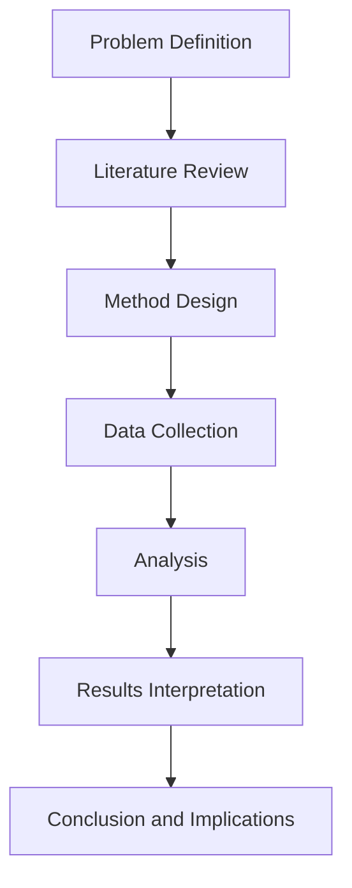

# Final Updated Manuscript Figure

This file contains the final, updated figure draft for the manuscript.

## Figure 1. Study Workflow Overview

## Figure Caption (Submission Version)

**Figure 1. Study workflow from problem definition through conclusions.**  
The figure summarizes the full research process used in this manuscript, including framing, method development, data collection, analysis, and interpretation.

## Final Check Before Submission

- [ ] Match terminology with manuscript section headings
- [ ] Ensure font/format is journal-compliant
- [ ] Confirm figure number and in-text citation consistency
- [ ] Export high-resolution final figure (if required by venue)
